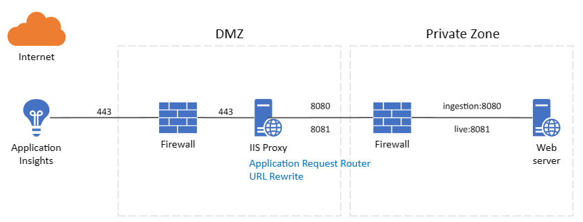
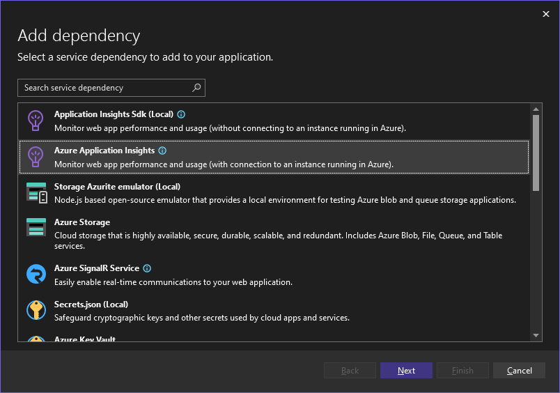
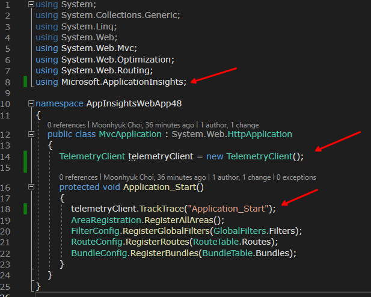
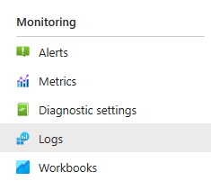
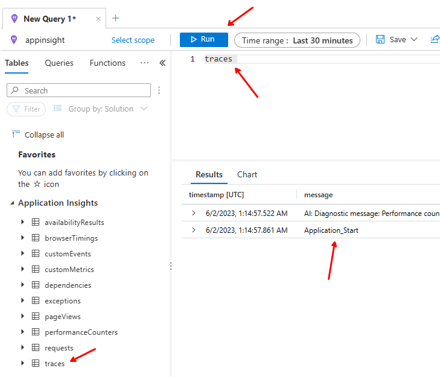
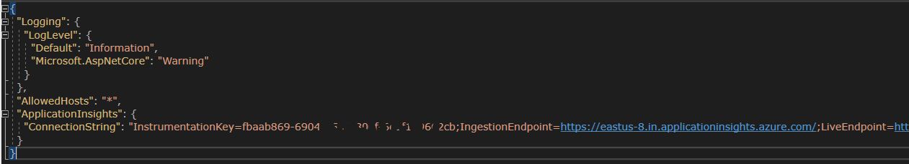
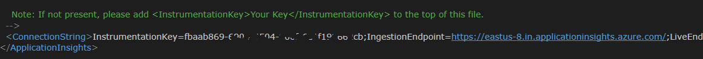

# Overview
In order to configure Application Insights on a web server that is not connected to the Internet(offline), it can be set using Application Request Router and URL Rewrite, which are features of IIS.

# Prerequisites
- IIS 8+(IIS Proxy)
- Install [Application Request Routing 3.0](files/requestRouter_amd64.msi) on your IIS proxy server
- Install [URL Rewrite](files/rewrite_amd64_en-US.msi) on your IIS proxy server

# Configuring Application Insights in your project
Add Application Insights to your project by referring to the following document

[Add Azure Application Insights by using Visual Studio Connected Services](https://learn.microsoft.com/en-us/visualstudio/azure/azure-app-insights-add-connected-service?view=vs-2022)

## (optional)Add Trace (To explicitly write the log)
Add the following code to the .NET Framework 4.8 project Global.aspx.cs

## (optional)Confirmation
[Azure Portal](https://portal.azure.com) select Monitoring -> Logs of Application Insights

Close the suggested query pop-up window, double-click traces, run with Run with traces selected in the query edit window (logs are recorded after about 20 seconds to 1 minute)

# Configuring Application Insights use proxy
You can find application insights endpoint in your project config file.
ASP.NET Core / appsettings.json

ASP.NET .NET Framework / Applicationinsights.config

** continue later

